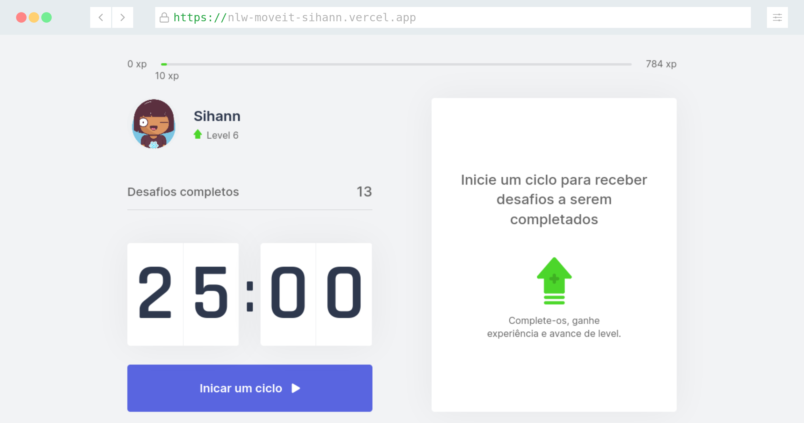
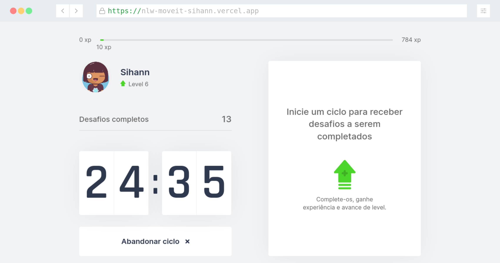
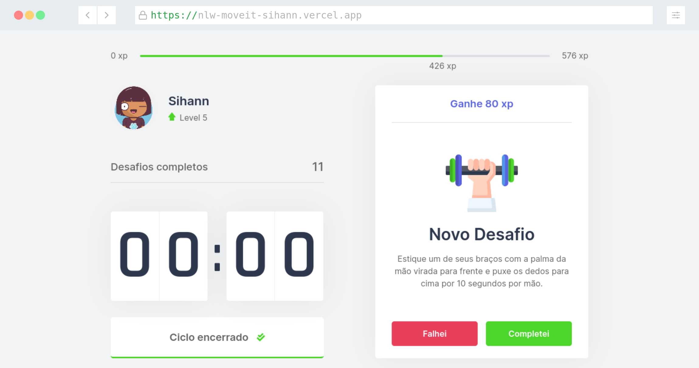

<p align="center"></p>

<h2 align="center">Track your time and take care of your health</h2> 

<p align="center"></p>
<p align="center"></p>

## :star2: About
  Move.it is a project created by [Rocketseat](https://rocketseat.com.br) initially to be a platform that combines the technique of pomodoro with exercises for well-being for those who spend many hours in front of a computer.

## :rainbow: Preview

- [Live Preview](https://nlw-moveit-sihann.vercel.app/)
- [Figma](https://www.figma.com/file/ge20pu3ofMOKoliUyKx1Nl/Move.it-1.0)

## :computer: Technologies

- [Next.js](https://nextjs.org/)
- [React](https://reactjs.org/)
- [TypeScript](https://www.typescriptlang.org/)

## :wrench: How to use

```
#clone repository
$ git clone https://github.com/sihann/nlw-moveit.git


# install dependencies
$ yarn

$ npm install


# run app
$ yarn dev

$ npm start 
```
Open http://localhost:3000 to view it in the browser.

## :space_invader: Issues

Let me know if you find some issue 
[Report here](https://github.com/sihann/nlw-moveit/issues)

## :pushpin: License

[MIT License](https://github.com/sihann/nlw-moveit/blob/main/LICENSE)

-----
<p align="center">Make with :purple_heart: by Delania Oliveira.</p>

